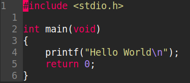
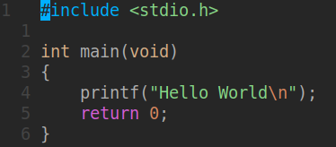
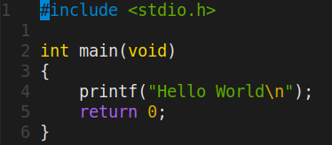

# VimConfig

## Introduction

Simple Vim configuration script to get started right the way!

The configurations include:
- Support relative numbering
- Ignore non editable files
- Set tabs as 4 space characters
- Ignore case during searches
- Highlight searched words
- New colorschemes
- New keymaps

This solution is targeted for begginers in both Vim and Linux that want to have a basic starting point without going deep into configurations.
Jump into action!

## Instructions

### Installing Vim

Visual Interface Improved (Vim) editor is usually available by default in most Unix systems. In case Vim is not installed by default, use the following command:
 
- Debian-based (Debian, Ubuntu, Linux Mint, Pop OS)
```shell
sudo apt install vim
```

- Arch-based (Arch, Manjaro, EndeavourOS, Garuda Linux)
```shell
sudo pacman -S vim
```

- Fedora-based (Fedora, Nobara, Ultramarine)
```shell
sudo dnf install vim
```

### Configuring Vim

With Vim already installed, just run the following script:

```shell
./setup.sh
```

Now Vim should now be configured and ready!
Note that if a previous configuration was already available on the system the script might not execute properly.

## Features Overview

### Colorschemes

There are 3 colorschemes added to this repository:

- Onedark
- Onedark Custom
- Monokai

By default, Onedark Custom is set. One may change it by uncommenting the desired scheme in .vimrc. Here are some samples of the colorschemes with C language:
   

### Keymaps

There are only 3 keymaps set:

- Ctrl + C -> Esc in insert mode
- Ctrl + / -> Comment line
- Ctrl + Shift + / -> Uncomment line

## Notes

- Windows is not supported!
- Tested on Manjaro and Ubuntu (24.04)

